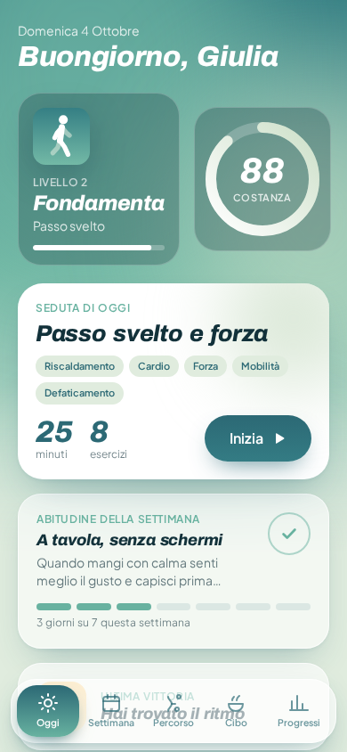
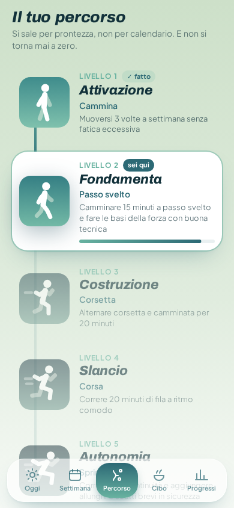
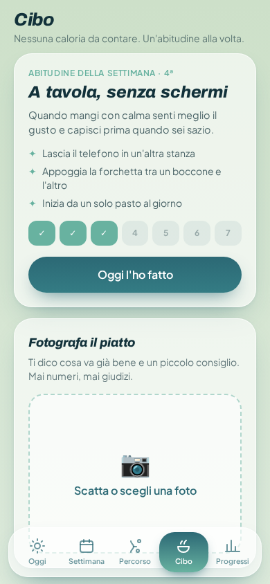
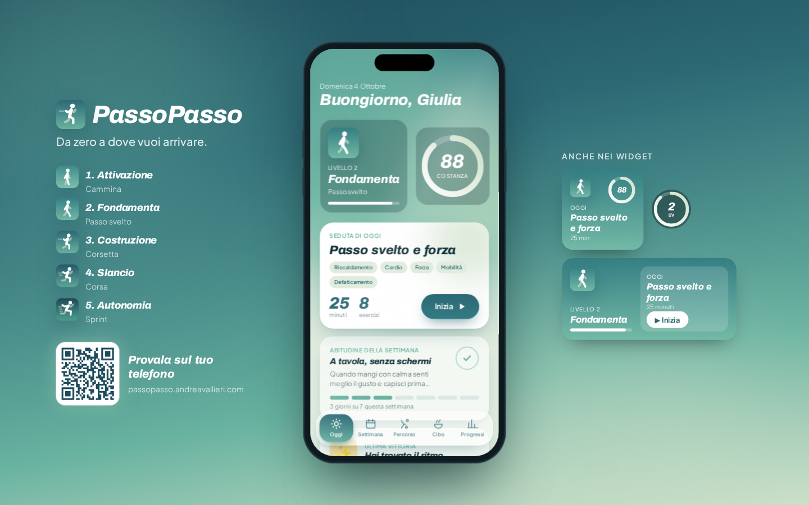
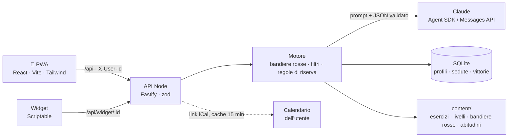

# PassoPasso

*Da zero a dove vuoi arrivare.*

Un coach fitness con l'AI per chi parte da zero. Ti porta dalla camminata alla corsa in 5 livelli, adatta ogni seduta a come stai oggi e non ti fa mai sentire in colpa.

Progetto per l'**Agent Coding Hackathon Solovera**, challenge 02 "Fitness Planning for Newbies".

**Demo:** https://passopasso.andreavallieri.com, poi tocca "Prova con l'utente demo".

| Home | Percorso | Cibo |
|---|---|---|
|  |  |  |



## Il problema
- Il **70%** degli utenti abbandona le app salute e fitness entro 100 giorni (mediana su 525.824 utenti) [1].
- In palestra il 63% dei nuovi iscritti molla entro 3 mesi [2].
- I piani sono rigidi: non si adattano a sedute saltate, poco tempo o dolori [3].
- Streak e notifiche colpevolizzano: al primo giorno saltato si riparte da zero [4].
- Il conteggio delle calorie stanca e può fare danni: il 73% dei pazienti con disturbo alimentare che usavano MyFitnessPal lo considerava un fattore che aveva contribuito [5].
- Un chatbot generico fa piani corretti al 90% ma completi solo al 41%, e non fa domande [6].

## Come funziona

### Un percorso in 5 livelli
In circa 12 settimane. Si sale per prontezza, non per calendario, e il percorso non si azzera mai. **L'icona dell'app evolve con il livello**: l'omino passa dal camminare allo sprint.

| | Livello | Attività |
|---|---|---|
|  | 1. Attivazione | cammina |
|  | 2. Fondamenta | passo svelto |
|  | 3. Costruzione | corsetta |
|  | 4. Slancio | corsa |
|  | 5. Autonomia | sprint |

### Tre percorsi, gli stessi 5 livelli
L'obiettivo scelto nell'onboarding decide il percorso. Livelli e icone restano uguali; cambiano verbi, obiettivi e struttura delle sedute.
- **Corsa:** dalla camminata allo sprint. Ai livelli 4-5 la settimana è quella di un podista (facile, qualità, lungo, più forza di supporto) con **sedute a segmenti**: timer grande, ripetute "3/6", sforzo percepito (RPE) spiegato in una riga. Il lungo cresce di 5 minuti a settimana e ogni quarta settimana c'è lo scarico.
- **Forza:** dalla sedia al corpo libero, poi elastici e manubri se li hai.
- **Mobilità:** schiena, anche, collo e spalle, pensato per chi lavora seduto.

Chi corre già risponde a 3 domande in più (km a settimana, corsa più lunga, ritmo) e parte dal livello 4 o 5. Sotto i 16 anni l'app non crea un piano e invita a usarla con un adulto; a 16-17 anni si arriva al massimo al livello 3.

### Un piano che si adatta
- **La tua scheda:** età, sesso, altezza, peso, lavoro, sonno e le 7 domande di salute del PAR-Q+. Il peso serve solo a tarare il carico: non è mai un obiettivo e l'app non lo mostra più. Con una risposta a rischio, l'app propone solo camminata e mobilità e consiglia di sentire il medico.
- **Onboarding a conversazione:** dopo la scheda, 4-5 domande in chat (obiettivo, esperienza, tempo, attrezzatura, dolori), poi la prima settimana.
- **Check-in prima di ogni seduta:** tempo, energia e mappa del corpo per i dolori. La seduta si rigenera e l'AI spiega in una frase perché è cambiata. Con le ginocchia doloranti, per esempio, la camminata lascia il posto alla marcia in casa.
- **Coach sempre disponibile:** scrivi cosa è cambiato ("questa settimana lavoro di sera") e il piano si aggiorna, con l'elenco di cosa è cambiato davvero.
- **Calendario:** colleghi il tuo calendario con un link iCal e PassoPasso sposta le sedute negli spazi liberi. Gli eventi non vengono salvati né passati all'AI: solo gli spazi liberi.
- **Seduta saltata:** la settimana si riorganizza e arriva una seduta di ripartenza con 10 punti di bonus. Premiare chi riprende funziona meglio che punire chi si ferma [7].
- **Feedback dopo la seduta** (facile / giusto / duro): l'intensità della prossima si regola.
- **Test di prontezza:** per salire di livello non basta il calendario. Alzati e siediti per 30 secondi (con i valori di riferimento per età e sesso di Rikli & Jones [12]) e un minuto di marcia con la scala dello sforzo. Se oggi non va, "Non oggi" e si riprova la settimana dopo.
- **Omino animato** per ogni esercizio e **controllo della forma** sullo squat con la fotocamera (MediaPipe).

### Motivazione senza colpa
- **Punteggio di costanza** sugli ultimi 28 giorni al posto della streak: saltare un giorno non compromette un'abitudine [8].
- Vittorie che non dipendono dalla bilancia.
- Tono sempre gentile: "Capita. Riprendiamo da qui, con calma."
- Widget per la schermata del telefono (galleria su `/widget`, script per Scriptable su iPhone).

### Alimentazione senza calorie
- **Mini-onboarding** di 5 domande: l'AI sceglie la prima abitudine tra 12, ispirate alle linee guida CREA [9], e spiega perché ("Bevi già abbastanza: partiamo dalla colazione").
- **Prima e dopo:** nei giorni di seduta, quando mangiare rispetto all'allenamento, in base all'orario e al tipo di seduta. Mai quantità.
- **Foto del piatto:** il feedback dice cosa va bene e cosa aggiungere, e disegna il piatto in tre parti (verdura, proteine, cereali) come nell'Healthy Eating Plate di Harvard [11]. Mai calorie né numeri; l'immagine non viene salvata.
- **Riepilogo della settimana:** punti forti, cosa manca e l'abitudine della settimana dopo.
- Se dici di avere una condizione medica, il coach ti indirizza a un dietista. Davanti a segnali di restrizione, risponde con cura e consiglia un professionista. Niente diete.

### I tuoi dati
Niente account, niente pubblicità. I dati stanno su un server in Europa e li cancelli quando vuoi. Dal Coach, "I miei dati": esporta tutto in JSON, aggiungi la settimana al tuo calendario (`.ics`), cancella tutto con un tocco. "Perché funziona" mostra ogni scelta di design con la sua fonte scientifica.

## Domande della giuria

| Domanda | Risposta | Dove vederlo |
|---|---|---|
| È solo per chi cammina? | No. Tre percorsi (corsa, forza, mobilità) sugli stessi 5 livelli, scelti dall'obiettivo. | Percorso, onboarding |
| E se sono già allenato? | Con 3 domande da corridore parti dal livello 4 o 5, con una settimana da podista: facile, ripetute, lungo. I km reali da Strava aggiustano il volume. | Utente `demo-runner` (Luca, 43 anni, 25 km a settimana) |
| Come vedo i progressi senza bilancia? | Punteggio di costanza, livelli, test di prontezza (sit-to-stand), minuti e sedute, vittorie. Il peso serve solo a tarare il carico e non viene più mostrato. | Home, Progressi, test di prontezza |
| E l'alimentazione? | Un'abitudine a settimana scelta per te, consigli su quando mangiare rispetto alla seduta, foto del piatto con il piatto in tre parti. Mai calorie: il conteggio fa male a molti [5]. | Tab Cibo |
| Mi serve attrezzatura? | No. Si parte con una sedia e un muro. Elastici e manubri, se li hai, sbloccano 12 esercizi in più. | La tua scheda, Coach |
| Che cosa fate con i miei dati? | Niente account e niente pubblicità. Server in Europa, export in un tocco, cancellazione immediata. Dal calendario leggiamo solo gli spazi liberi. | Coach → I miei dati |
| Si adatta ai miei impegni? | Colleghi il calendario con un link iCal e le sedute vanno negli spazi liberi. La settimana pianificata si aggiunge al tuo calendario. | Coach → Collega il calendario |
| Perché dovrebbe funzionare? | Ogni scelta ha una fonte: ripartenza premiata (Milkman), costanza invece della streak (Lally), PAR-Q+, progressione graduale, niente calorie. | Percorso → Perché funziona |
| E se l'AI sbaglia? | L'AI sceglie solo da un catalogo verificato, le bandiere rosse sono controllate prima da regole fisse e ogni risposta è validata. Se l'AI non risponde, la seduta si fa a regole. | Sezione Sicurezza |
| E i minorenni? | Sotto i 16 anni niente piano: l'app invita a usarla con un adulto. A 16-17 anni massimo livello 3. | Onboarding |

## Sicurezza
PassoPasso non sostituisce il parere di un medico. Per questo l'AI lavora dentro confini stretti:

1. **Screening e bandiere rosse prima dell'AI.** La scheda iniziale contiene le 7 domande del PAR-Q+ [10]. Dolore al petto, svenimento, fiato corto a riposo, palpitazioni e altri 5 sintomi (da PAR-Q+ e ACSM [10]) bloccano la seduta con regole fisse, senza chiamare l'AI. Per i sintomi urgenti l'app indica il 112. Lo stesso controllo, con parole chiave, vale per i messaggi al coach. Un sintomo sconosciuto blocca comunque, per prudenza.
2. **Catalogo verificato.** Gli esercizi sono scritti a mano in [`content/`](content/), con le fonti in [`content/FONTI.md`](content/FONTI.md) (OMS, ACSM, NHS Couch to 5K). L'AI vede solo gli esercizi già filtrati e risponde con i loro id: quelli sconosciuti vengono scartati.
3. **Filtri deterministici.** Esercizi sopra il livello, senza l'attrezzatura giusta o che coinvolgono una zona dolorante vengono esclusi; al loro posto c'è la versione più facile, se è sicura.
4. **Taratura sulla persona.** Se la scheda sconsiglia gli impatti, niente salti, corsa o scatti (al loro posto camminata veloce o step). Se lo screening PAR-Q+ segnala un rischio, solo camminata, mobilità e respirazione finché non confermi il parere del medico. Con 65 anni o più, o meno di 6 ore di sonno, si parte più piano. Età, sesso e BMI arrivano all'AI solo come contesto per i dosaggi e non compaiono mai nei testi.
5. **Output validato.** Ogni risposta di Claude è JSON validato con zod. Dosaggi riportati nei limiti, riscaldamento e defaticamento sempre presenti. Nel feedback sul cibo, le frasi con numeri, calorie, peso o diete vengono scartate.
6. **Regole di riserva.** Se l'AI fallisce o supera i 25 secondi, il motore costruisce la seduta a regole. L'app funziona anche con l'AI spenta (`AI_MODE=off`).

## Architettura



- **Frontend** ([`app/web/`](app/web/)): PWA installabile, mobile-first. Su desktop l'app compare dentro una cornice iPhone, con i widget a lato.
- **Backend** ([`app/server/`](app/server/)): Node 22, TypeScript, Fastify, `better-sqlite3`, zod. Contratto in [`docs/api.md`](docs/api.md), tipi in [`docs/schema.md`](docs/schema.md).
- **AI:** Claude (`claude-sonnet-5-5`) chiamato solo dal server, con il Claude Agent SDK (token dell'abbonamento) oppure l'SDK Anthropic (chiave API). Usato per onboarding, rigenerazione delle sedute, coach, feedback sulle foto dei piatti.
- **Contenuti** ([`content/`](content/)): 60 esercizi, 5 livelli, 12 abitudini, 9 bandiere rosse, 19 vittorie, con uno script di validazione.

## Avvio locale

Serve Node 22.

```bash
cd app/server
npm install
cp .env.example .env    # inserisci ANTHROPIC_API_KEY oppure CLAUDE_CODE_OAUTH_TOKEN
npm run dev             # API su http://localhost:3210
```

In un altro terminale:

```bash
cd app/web
npm install
npm run dev             # PWA su http://localhost:5180, con proxy verso l'API
```

Senza credenziali il server parte lo stesso e usa le regole di riserva. Per provare il motore: `npm run smoke` in `app/server`.

## Deploy con Docker

```bash
cp .env.example .env    # la prima volta: inserisci una delle due credenziali AI
docker compose up -d --build
```

L'app (API e PWA) risponde su `http://127.0.0.1:3210`. Il database SQLite sta nel volume `passopasso-data`.

- [`Dockerfile`](Dockerfile) multi-stage: build della PWA, build del server, immagine finale `node:22-slim` con le sole dipendenze di produzione.
- [`docker-compose.yml`](docker-compose.yml): healthcheck su `/api/health`, `restart: unless-stopped`.
- [`deploy/deploy.sh`](deploy/deploy.sh): pull, build, avvio, attesa dell'healthcheck e smoke test in un comando.
- In produzione l'app è dietro un tunnel Cloudflare. Dettagli in [`deploy/README.md`](deploy/README.md).

| Variabile | Default | Note |
|---|---|---|
| `ANTHROPIC_API_KEY` | — | chiave API Anthropic |
| `CLAUDE_CODE_OAUTH_TOKEN` | — | in alternativa: token da `claude setup-token` |
| `AI_MODE` | `auto` | `off` = solo regole di riserva |
| `AI_MODEL` | `claude-sonnet-5-5` | |
| `PORT` | `3210` | |

## Come l'abbiamo costruita: 6 agenti Claude Code
PassoPasso è stata sviluppata in poche ore da **cinque sessioni di Claude Code in parallelo** sullo stesso repository, più una **chat di regia**. Ogni chat ha il suo prompt e le sue cartelle; nessuna modifica i file delle altre.

| Chat | Ruolo | Cartelle |
|---|---|---|
| Regia | contratto API, integrazione, collaudo | `docs/api.md`, `docs/schema.md` |
| 1 | Frontend PWA | `app/web/` |
| 2 | Backend e AI | `app/server/` |
| 3 | Contenuti e sicurezza, QA con Playwright | `content/` |
| 4 | Deploy, PWA tecnica, controllo della forma, omino animato | `deploy/`, `Dockerfile` |
| 5 | Pitch e consegna | `pitch/`, `README.md` |

Come si coordinano:
- **Un contratto condiviso** ([`docs/api.md`](docs/api.md), [`docs/schema.md`](docs/schema.md)) che solo la regia modifica: frontend e backend lavorano in parallelo senza aspettarsi.
- **Una bacheca delle richieste** ([`docs/agenti/richieste.md`](docs/agenti/richieste.md)): una chat che ha bisogno di qualcosa fuori dalle sue cartelle lo chiede lì, e la regia risponde.
- **Uno stato dei lavori** ([`docs/agenti/stato.md`](docs/agenti/stato.md)) con una riga per ogni blocco finito.
- **Git disciplinato:** commit piccoli con il prefisso `[chat-N]`, solo sui propri percorsi, `git pull --rebase --autostash` prima di ogni push.

I prompt di tutte le chat sono in [`docs/agenti/`](docs/agenti/).

## Roadmap
La demo è una PWA, così la provi da un link senza installare niente. Prossimi passi:
- **Notifiche native** con l'app sugli store (oggi: Web Push).
- **Wearable** nativi: Apple Salute e Health Connect senza passaggi manuali, Garmin, Fitbit, Oura.
- **Altre lingue**, a partire dall'inglese: testi e contenuti sono già separati dal codice.
- **Community:** gruppi piccoli di persone allo stesso livello, senza classifiche.

## Struttura
- `app/web/`: PWA
- `app/server/`: API, motore e prompt dell'AI
- `content/`: catalogo verificato di esercizi, livelli, bandiere rosse, abitudini e testi
- `brand/`: icone, favicon, scheda del brand
- `deploy/`: script di deploy e tunnel
- `docs/`: contratto API, schema, ricerca, coordinamento degli agenti
- `pitch/`: script del video, scaletta della demo, testi per la consegna, screenshot

## Fonti
1. Abbandono delle app salute e fitness, JMIR 2024, 525.824 utenti. https://www.jmir.org/2024/1/e56897
2. Abbandono in palestra, Sperandei et al. 2016. http://www.scielo.br/j/rbce/a/WtzM3gBFRkcrqY7xKZsVNnm/?lang=en
3. Recensione di Fitbod: "No real injury filter". https://www.autonomous.ai/ourblog/fitbod-app-review
4. Streak e gamification eccessiva, The Decision Lab. https://thedecisionlab.com/insights/consumer-insights/streak-creep-the-perils-of-too-much-gamification
5. MyFitnessPal e disturbi alimentari, Levinson et al. 2017. https://www.sciencedirect.com/science/article/abs/pii/S1471015317301484
6. ChatGPT come personal trainer, TIME 2024. https://time.com/6958557/chatgpt-workout-plan/
7. Megastudio sull'esercizio fisico, Milkman et al., Nature 2021. https://www.nia.nih.gov/news/testing-ways-encourage-exercise
8. Formazione delle abitudini, Lally et al. 2010. https://www.researchgate.net/publication/32898894
9. CREA, Linee guida per una sana alimentazione 2018. https://www.crea.gov.it/web/alimenti-e-nutrizione/-/linee-guida-per-una-sana-alimentazione-2018
10. PAR-Q+ (https://eparmedx.com/) e screening ACSM, Riebe et al. 2015 (https://pubmed.ncbi.nlm.nih.gov/26473759/)
11. Harvard T.H. Chan School of Public Health, Healthy Eating Plate. https://www.hsph.harvard.edu/nutritionsource/healthy-eating-plate/
12. Rikli R.E., Jones C.J., *Senior Fitness Test Manual*, Human Kinetics, 2ª ed. 2013: test di 30 secondi su sedia con i valori di riferimento per età e sesso.

Altri dati in [`docs/ricerca.md`](docs/ricerca.md). Fonti dei contenuti in [`content/FONTI.md`](content/FONTI.md).
